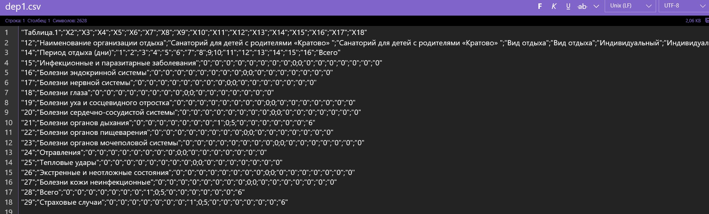
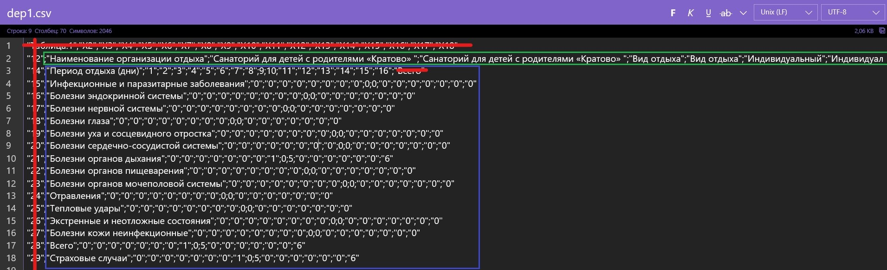
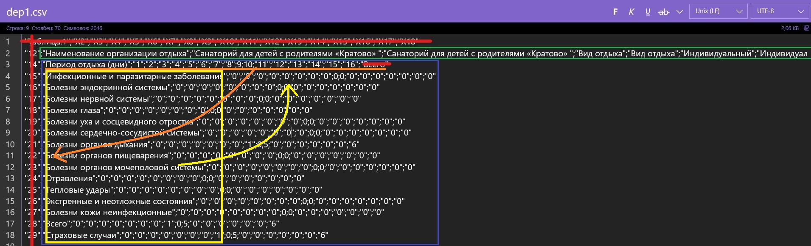

Решение тестового задания
================
Костас Спирлиев
16 06 2020

  - [Введение](#введение)
  - [Знакомство с данными](#знакомство-с-данными)
  - [Предобработка данных](#предобработка-данных)
  - [Задание 1](#задание-1)
  - [Задание 2](#задание-2)
  - [Задание 3](#задание-3)
  - [Результаты](#результаты)

<style>body {text-align: justify} </style>

### Введение

Данный отчет является решением тестового задания на вакансию аналитика в
Мосгортур. Полное описание задания можно посмотреть
[здесь](https://github.com/KostasSpirliev/test_task/blob/master/test_task.md).
Задание связано с данными обращений отдыхающих в различных рекреационных
организациях к медицинскому персоналу. В начале каждой главы
формулировки соответствующих задач будут продублированы.

### Знакомство с данными

**Из задания:**

<center>

<span style="color: grey;">*В папке
[data](https://github.com/KostasSpirliev/test_task/tree/master/data)
размещены заархивированные данные о количестве обращений отдыхающих
к медицинскому персоналу организаций отдыха в форматах xlsx и csv
(данные в обоих архивах одинаковы, они различаются только
форматом)*

</center>

</span> 

Будем работать с csv-форматом. Разархивируем данные в папку “csv”:

``` r
# Необходимо поменять атрибут чанка eval на TRUE (по умолчанию он не работает), чтобы
# воспроизвести данный код.
# Загрузить пакет для разархивации, если это необходимо:
# install.packages("zip")
library(zip)
unzip("data/csv.zip", exdir = "data")
```

Посмотрим на разархивированные файлы: выведем первые 10 названий файлов
и подсчитаем их общее количество:

``` r
head(list.files("data/csv/"), 10)
```

    ##  [1] "dep1.csv"   "dep10.csv"  "dep100.csv" "dep101.csv" "dep102.csv"
    ##  [6] "dep103.csv" "dep104.csv" "dep105.csv" "dep106.csv" "dep107.csv"

``` r
paste("количество файлов:", length(list.files("data/csv/")))
```

    ## [1] "количество файлов: 181"

Наши данные разбиты на 181 csv-файла. Посмотрим, на один из них, на файл
dep1.csv, в обычном редакторе:



Теперь проанализируюем структуру данных:



<span style="color: red;">**Красным**</span> выделены бесполезные данные
– это просто нумерация столбцов и строчек, которые не несут никакого
содержания: они не нужны нам.
<span style="color: blue;">**Синим**</span> выделены наши
переменные – дни отдыха и виды заболеваний, по которым
классифицируются обращения отдыхающих к медицинскому персоналу;
также есть переменная “всего”, суммирующая все обращения за день и
“страховые случаи” – количество страховых случаев из всех
обращений за день.
<span style="color: green;">**Зеленым**</span> выделены важные
метаданные: название организации отдыха, вид отдыха, номер
заезда/смены и период заезда/смены (некоторые данные не
поместились в скриншот – я перечисляю их здесь).

Попробуем с помощью выделенных структур данных определить одно из
наблюдений:

<center>

*В Санатории “Кратово” на восьмой день отдыха было одно обращение,
классифицированное медработниками в категорию “Болезни органов
дыхания” (смена индивидуальная, период заезда/смены: 23.03.2019 -
07.04.2019)*

</center>

Все остальные файлы с данными имеют идентичную структуру. Для дальнейшей
работы с ними необходимо привести их в data frame формат, где строчки –
это наши наблюдения, а столбцы – это переменные, по которым велись
наблюдения. Из нашего примера ясно, что единицей наблюдения
является день отдыха, а переменными – типы болезней и
метаданные. После приведения данных из всех файлов в
единообразный data frame формат, их можно объеденить в один
большой data frame (для удобства дальнейшей работы). Следовательно,
концептуально наши данные после предобработки должны выглядеть так:

| День | Инфекц. и паразит. заболевания | … | Болезни кожи инфекц. | Всего | Страх. случаи | Название  | … |
| :--: | :----------------------------: | :-: | :------------------: | :---: | :-----------: | :-------: | :-: |
|  1   |               3                | … |          2           |   5   |       2       |  Кратово  | … |
|  2   |               0                | … |          0           |   0   |       0       |  Кратово  | … |
|  …   |               …                | … |          …           |   …   |       …       |  Кратово  | … |
|  1   |               1                | … |          3           |   8   |       2       | Жемчужина | … |
|  …   |               …                | … |          …           |   …   |       …       |     …     | … |

Концептуальное представление данных

### Предобработка данных

Подключим необходимые пакеты для дальнейшей работы:

``` r
# Если необходимо:
# install.packages("readr")
# install.packages("dplyr")
# install.packages("tidyr")
# install.packages("stringr")
# install.packages("ggplot2")
library(readr)
library(dplyr)
library(tidyr)
library(stringr)
library(ggplot2)
```

Еще раз посмотрим на наш файл desc1.csv. Пока что будем работать только
с ним:



Для того чтобы привести данные в data frame вид, нам необходимо,
во-первых, “транспонировать” исходную таблицу: переменные,
выделенные <span style="color: yellow;">**желтым**</span>,
сделать столбцами, а дни отдыха, выделенные
<span style="color: orange;">**оранжевым**</span>, превратить в строчки
(наблюдения). Во-вторых, нужно отдельно вычистить всю
<span style="color: green;">**зеленую**</span> строчку с метаданными и
оставить там только все необходимое, и потом присоединить очищенные
метаданные к остальным переменными. И, в-третьих, следует избавиться
от лишней информации, выделенной
<span style="color: red;">**красным**</span>.

``` r
# чтение данных
data <- read_delim("data/csv/dep1.csv", ";", 
                     escape_double = FALSE, trim_ws = TRUE, 
                     skip = 2, col_types = cols(`14` = col_skip()), )
colnames(data)[colnames(data) == "14_1"] <- "14"

# "транспонирование" таблицы
data <- as_tibble(t(data[, -1]), 
                  .name_repair = ~data[[1]])
data <- tibble("Дни" = rownames(data)[-nrow(data)], data[-nrow(data), ])

# чтение и очистка метаданных с помощью stringr
meta_data <- read_lines("data/csv/dep1.csv", skip = 1, n_max = 1)
meta_data <- str_split(meta_data, pattern = ";")[[1]]
meta_data <- unique(str_remove_all(meta_data, "[\"]"))[-1]
meta_data <- na_if(meta_data, "NA")

# подсоединение к полученному датафрейму готовых метаданных    
data$`Организация отдыха` <- meta_data[2]
data$`Вид отдыха` <- meta_data[4]
data$`Номер заезда/смены` <- meta_data[6]
data$`Период заезда` <- meta_data[8]
```

Посмотрим на полученный результат:

``` r
glimpse(data)
```

    ## Rows: 16
    ## Columns: 20
    ## $ Дни                                       <chr> "1", "2", "3", "4", "5", ...
    ## $ `Инфекционные и паразитарные заболевания` <dbl> 0, 0, 0, 0, 0, 0, 0, 0, 0...
    ## $ `Болезни эндокринной системы`             <dbl> 0, 0, 0, 0, 0, 0, 0, 0, 0...
    ## $ `Болезни нервной системы`                 <dbl> 0, 0, 0, 0, 0, 0, 0, 0, 0...
    ## $ `Болезни глаза`                           <dbl> 0, 0, 0, 0, 0, 0, 0, 0, 0...
    ## $ `Болезни уха и сосцевидного отростка`     <dbl> 0, 0, 0, 0, 0, 0, 0, 0, 0...
    ## $ `Болезни сердечно-сосудистой системы`     <dbl> 0, 0, 0, 0, 0, 0, 0, 0, 0...
    ## $ `Болезни органов дыхания`                 <dbl> 0, 0, 0, 0, 0, 0, 0, 1, 0...
    ## $ `Болезни органов пищеварения`             <dbl> 0, 0, 0, 0, 0, 0, 0, 0, 0...
    ## $ `Болезни органов мочеполовой системы`     <dbl> 0, 0, 0, 0, 0, 0, 0, 0, 0...
    ## $ Отравления                                <dbl> 0, 0, 0, 0, 0, 0, 0, 0, 0...
    ## $ `Тепловые удары`                          <dbl> 0, 0, 0, 0, 0, 0, 0, 0, 0...
    ## $ `Экстренные и неотложные состояния`       <dbl> 0, 0, 0, 0, 0, 0, 0, 0, 0...
    ## $ `Болезни кожи неинфекционные`             <dbl> 0, 0, 0, 0, 0, 0, 0, 0, 0...
    ## $ Всего                                     <dbl> 0, 0, 0, 0, 0, 0, 0, 1, 0...
    ## $ `Страховые случаи`                        <dbl> 0, 0, 0, 0, 0, 0, 0, 1, 0...
    ## $ `Организация отдыха`                      <chr> "Санаторий для детей с ро...
    ## $ `Вид отдыха`                              <chr> "Индивидуальный", "Индиви...
    ## $ `Номер заезда/смены`                      <chr> NA, NA, NA, NA, NA, NA, N...
    ## $ `Период заезда`                           <chr> "23.03.2019 - 07.04.2019"...

Отлично, все получилось, и теперь данные соотвествуют задуманному в
прошлой главе data frame формату (16 строчек в датафрейме
соотвествуют 16 дням в смене санатория “Кратово”). Теперь
можно оформить функцию общего вида на основе проделанной
предобработки данных для всех 181 файлов, и сразу объеденить
их (функция, читающая данные, называется *read\_spec\_data* и находится
[здесь](https://github.com/KostasSpirliev/test_task/blob/master/analysis/read_spec_data.R)):

``` r
source("analysis/read_spec_data.R", encoding = "UTF-8") # подгружаем функцию
path_to_data <- paste0("data/csv/", list.files("data/csv/")) # пути к файлам

# Читаем все файлы и объединяем их в единый датафрейм (функция может выполняться долго - 10-20 секунд)
data_result <- do.call(rbind, lapply(path_to_data, function(x) read_spec_data(x)))
```

Еще раз посмотрим на уже финальную версию рабочего дата фрейма:

``` r
glimpse(data_result)
```

    ## Rows: 3,559
    ## Columns: 20
    ## $ Дни                                       <chr> "1", "2", "3", "4", "5", ...
    ## $ `Инфекционные и паразитарные заболевания` <dbl> 0, 0, 0, 0, 0, 0, 0, 0, 0...
    ## $ `Болезни эндокринной системы`             <dbl> 0, 0, 0, 0, 0, 0, 0, 0, 0...
    ## $ `Болезни нервной системы`                 <dbl> 0, 0, 0, 0, 0, 0, 0, 0, 0...
    ## $ `Болезни глаза`                           <dbl> 0, 0, 0, 0, 0, 0, 0, 0, 0...
    ## $ `Болезни уха и сосцевидного отростка`     <dbl> 0, 0, 0, 0, 0, 0, 0, 0, 0...
    ## $ `Болезни сердечно-сосудистой системы`     <dbl> 0, 0, 0, 0, 0, 0, 0, 0, 0...
    ## $ `Болезни органов дыхания`                 <dbl> 0, 0, 0, 0, 0, 0, 0, 1, 0...
    ## $ `Болезни органов пищеварения`             <dbl> 0, 0, 0, 0, 0, 0, 0, 0, 0...
    ## $ `Болезни органов мочеполовой системы`     <dbl> 0, 0, 0, 0, 0, 0, 0, 0, 0...
    ## $ Отравления                                <dbl> 0, 0, 0, 0, 0, 0, 0, 0, 0...
    ## $ `Тепловые удары`                          <dbl> 0, 0, 0, 0, 0, 0, 0, 0, 0...
    ## $ `Экстренные и неотложные состояния`       <dbl> 0, 0, 0, 0, 0, 0, 0, 0, 0...
    ## $ `Болезни кожи неинфекционные`             <dbl> 0, 0, 0, 0, 0, 0, 0, 0, 0...
    ## $ Всего                                     <dbl> 0, 0, 0, 0, 0, 0, 0, 1, 0...
    ## $ `Страховые случаи`                        <dbl> 0, 0, 0, 0, 0, 0, 0, 1, 0...
    ## $ `Организация отдыха`                      <chr> "Санаторий для детей с ро...
    ## $ `Вид отдыха`                              <chr> "Индивидуальный", "Индиви...
    ## $ `Номер заезда/смены`                      <chr> NA, NA, NA, NA, NA, NA, N...
    ## $ `Период заезда`                           <chr> "23.03.2019 - 07.04.2019"...

Собрав данные со всех файлов, получилось 3559 наблюдений. Проверим
целостность наших данных: посмотрим на количество NA в каждой
переменной (количество NA отсортированы по убыванию; выбраны 6
первых переменных по количеству NA):

``` r
Na_vector <- sapply(data_result[, -1], function(x) sum(is.na(x)))
Na_table <- tibble("Переменные" = names(Na_vector), "Количество NA" = Na_vector) %>% 
    arrange(desc(`Количество NA`))
knitr::kable(head(Na_table))
```

| Переменные                              | Количество NA |
| :-------------------------------------- | ------------: |
| Номер заезда/смены                      |           301 |
| Инфекционные и паразитарные заболевания |             0 |
| Болезни эндокринной системы             |             0 |
| Болезни нервной системы                 |             0 |
| Болезни глаза                           |             0 |
| Болезни уха и сосцевидного отростка     |             0 |

NA есть только в переменной “Номер заезда/смены”. В принципе, это не так
критично, т.к. в дальнейших задачах эта переменная участвовать не будет.

Посмотрим на первые 5 организаций в нашем датафрейме. Также подсчитаем
общее количество организаций в датафрейме:

``` r
head(unique(data_result$`Организация отдыха`), 5)
```

    ## [1] "Санаторий для детей с родителями «Кратово» "                                                                                                              
    ## [2] "Российский государственный социальный университет  Учебно-реабилитационный молодежный центр «Алмаз»(обособка)"                                            
    ## [3] "Федеральное государственное бюджетное учреждение «Санаторий для детей с родителями «Кратово» Министерства здравоохранения Российской Федерации( обособка)"
    ## [4] "ФГБОУ «Всероссийский детский центр Орлёнок"                                                                                                               
    ## [5] "Детский лагерь Эволюция"

``` r
paste("Кол-во организаций:", length(unique(data_result$`Организация отдыха`)))
```

    ## [1] "Кол-во организаций: 47"

Теперь наши данные полностью готовы к решению последующих задач\!

### Задание 1

##### ***Из задания:***

<div style="color: grey;" data-align="left">

*По исходным данным сформировать сводную таблицу вида:*

| Организация отдыха                                            |      Период заезда      | Кол-во обращений | Кол-во страховых случаев |
| ------------------------------------------------------------- | :---------------------: | ---------------: | -----------------------: |
| Санаторий для детей с родителями «Кратово»                    | 23.03.2019 - 07.04.2019 |                6 |                        6 |
| Молодежный центр «Ай-Кэмп»                                    | 23.03.2019 - 07.04.2019 |               15 |                        0 |
| Детский реабилитационно-оздоровительный центр ДОЛ “Жемчужина” | 23.03.2019 - 07.04.2019 |                0 |                        0 |

*Сортировать таблицу по количеству обращений в порядке убывания.*

***Результат**: Электронная таблица формате csv/xlsx.*

</div>

##### ***Решение задания:***

С помощью *dplyr* сделаем необходимую сводную таблицу. Выведем первые 6
значений:

``` r
table_1 <- data_result %>% 
    group_by(`Организация отдыха`, `Период заезда`) %>% 
    summarise(`Количество обращений` = sum(`Всего`), 
              `Количество страховых случаев` = sum(`Страховые случаи`)) %>% 
    arrange(desc(`Количество обращений`))

knitr::kable(head(table_1))
```

| Организация отдыха                       | Период заезда           | Количество обращений | Количество страховых случаев |
| :--------------------------------------- | :---------------------- | -------------------: | ---------------------------: |
| Детский оздоровительный пансионат Россия | 24.06.2019 - 14.07.2019 |                  526 |                            0 |
| Детский оздоровительный лагерь Жемчужина | 13.07.2019 - 02.08.2019 |                  374 |                           28 |
| Детский оздоровительный лагерь Жемчужина | 31.05.2019 - 20.06.2019 |                  370 |                           20 |
| Детский оздоровительный пансионат Россия | 23.06.2019 - 13.07.2019 |                  270 |                            1 |
| Детский оздоровительный лагерь Жемчужина | 03.08.2019 - 23.08.2019 |                  248 |                           30 |
| Детский оздоровительный лагерь Жемчужина | 22.06.2019 - 12.07.2019 |                  211 |                           24 |

Выведем данные по организациям “Кратово”, “Жемчужина”, “Ай-Кэмп” (для
сверки с заданием):

``` r
table_1 %>% 
    filter(`Период заезда` == "23.03.2019 - 07.04.2019") %>% 
    arrange(desc(`Количество страховых случаев`)) %>% 
    knitr::kable()
```

| Организация отдыха                                          | Период заезда           | Количество обращений | Количество страховых случаев |
| :---------------------------------------------------------- | :---------------------- | -------------------: | ---------------------------: |
| Санаторий для детей с родителями «Кратово»                  | 23.03.2019 - 07.04.2019 |                    6 |                            6 |
| Молодежный центр «Ай-Кэмп»                                  | 23.03.2019 - 07.04.2019 |                   15 |                            0 |
| Детский реабилитационно-оздоровительный центр ДОЛ Жемчужина | 23.03.2019 - 07.04.2019 |                    0 |                            0 |

Данные полностью совпадают; задание выполнено :)

Сохраняем результат:

``` r
write_csv(table_1, path = "output/Спирлиев_1.csv")
```

### Задание 2

##### ***Из задания:***

<div style="color: grey;" data-align="center">

*Подсчитать сумму обращений по всем видам заболеваний и составить
сводную таблицу (вид заболевания / кол-во обращений).*
***Результат**: Электронная таблица формате csv/xlsx.*

</div>

##### ***Решение задания:***

С помощью *dplyr* и *tidyr* сделаем необходимую сводную таблицу,
отсортируем данные по количеству обращений. Выведем первые 6
значений:

``` r
table_2 <- data_result %>% 
    select(1:14) %>% 
    pivot_longer(2:14, names_to = "Организация отдыха", values_to = "Кол-во обращений") %>% 
    group_by(`Организация отдыха`) %>% 
    summarise(`Кол-во обращений` = sum(`Кол-во обращений`)) %>% 
    arrange(desc(`Кол-во обращений`))

knitr::kable(head(table_2))
```

| Организация отдыха                  | Кол-во обращений |
| :---------------------------------- | ---------------: |
| Болезни органов дыхания             |             1914 |
| Болезни уха и сосцевидного отростка |             1545 |
| Болезни органов пищеварения         |              423 |
| Болезни нервной системы             |              422 |
| Болезни глаза                       |              194 |
| Болезни сердечно-сосудистой системы |              117 |

Чаще всего в санаториях болеют легочными заболеваниями.

Сохраняем результат:

``` r
write_csv(table_2, path = "output/Спирлиев_2.csv")
```

### Задание 3

##### ***Из задания:***

<div style="color: grey;" data-align="center">

*Сформировать массив данных об обращениях из-за болезней органов дыхания
по дню отдыха и проверить, существуют ли закономерности в распределении
таких обращений по дням отдыха.*

***Результат**: Массив в формате csv/xlsx, краткое заключение о наличии
или отсутствии закономерности в текстовом документе
(docx/doc/rtf/odt).*

</div>

##### ***Решение задания:***

Создадим сводную таблицу:

``` r
table_3 <- data_result %>% 
    select(`Дни`, `Болезни органов дыхания`) %>% 
    pivot_longer(2, values_to = "Кол-во обращений") %>% 
    select(-2) %>% 
    group_by(`Дни`) %>% 
    summarise("Кол-во обращений" = sum(`Кол-во обращений`)) %>% 
    mutate(`Дни` = as.numeric(`Дни`)) %>% 
    arrange(desc(`Кол-во обращений`))
```

Для правильной интерпретации дальнейших результатов создадим
вспомогательную сводную таблицу с количеством смен разной
длительности:

``` r
data_result %>% 
    group_by(`Период заезда`) %>% 
    summarise(`Длительность смены (в днях)` = max(as.numeric(`Дни`))) %>% 
    group_by(`Длительность смены (в днях)`) %>% 
    summarise(`Количество смен` = n()) %>% 
    arrange(desc(`Количество смен`)) %>% 
    knitr::kable()
```

| Длительность смены (в днях) | Количество смен |
| --------------------------: | --------------: |
|                          21 |              41 |
|                          15 |               5 |
|                          16 |               5 |
|                          11 |               3 |
|                          14 |               3 |
|                          19 |               3 |
|                          10 |               2 |
|                          12 |               2 |
|                           8 |               1 |
|                           9 |               1 |
|                          13 |               1 |
|                          17 |               1 |
|                          18 |               1 |
|                          20 |               1 |
|                          22 |               1 |

Как мы видим, преобладают 21-дневные смены. Теперь визуализируем
результат сводной таблицы с количеством обращений с легочными
заболеваниями по дням:

``` r
ggplot(table_3, aes(x = `Дни`, y = `Кол-во обращений`, fill = `Кол-во обращений`)) +
    scale_fill_continuous(low = "white", high = "red") +
    scale_x_continuous(breaks = seq(1, 22)) +
    geom_col(color = "black") +
    ggtitle("Визуализация сводной таблицы") +
    theme(legend.position = "none")
```


На графике можно наблюдать определенные тренды: количество обращений по
легочным заболеваниям в санаториях линейно растут с 1 по 11 день,
достигают своего пика на 11 и 13 день, и начинают падать во второй
половине смены (со вторым небольшим скачком на 18 и 19 день). Любопытно
отменить, что на 22 день обращений вообще нет, т.к. в данных
присутствует всего лишь одна 22-дневная смена, в которой не
оказалось обращений на 22ой день.

Основная часть заболевших приходится на середину смены: возможно, это
связано с 1-2 недельным инкубационным периодом легочных заболеваний:
дети в начале смены заражают друг друга, и только после 1-2 недель
симптомы заболевания становятся очевидными как для ребенка, так и
для окружающих. Падение тредна к концу смены может быть связано с тем,
что дети (и их родители) решают переболеть болезнь дома к концу смены.
Однако более убедительные выводы можно будет сделать только при
глубоком понимании всех обстоятельств жизни в оздоровительных
комплексах.

Проверим с помощью критерия Хи-квадрата Пирсона статистически значимы ли
полученные результаты (исключим 22ой день, т.к. он не имеет смысла и
мешает корректной работе критерия):

``` r
chisq.test(table_3[-nrow(table_3),])
```

    ## 
    ##  Pearson's Chi-squared test
    ## 
    ## data:  table_3[-nrow(table_3), ]
    ## X-squared = 128.39, df = 20, p-value < 2.2e-16

P-value значительно меньше 0.05, а это значит, что получить таки
результаты при верности нулевой гипотезы крайне маловероятно –
это позволяет отклонить нулевую гипотезу и признать статистическую
значимость полученных результатов.

Сохраним полученный результат:

``` r
write_csv(table_3, path = "output/Спирлиев_3.csv")
```

### Результаты

Bсе задания выполнены\! Полученные результаты (три csv-файла) можно
посмотреть
[здесь](https://github.com/KostasSpirliev/test_task/tree/master/output)

<div class="tocify-extend-page" data-unique="tocify-extend-page" style="height: 0;">

</div>
